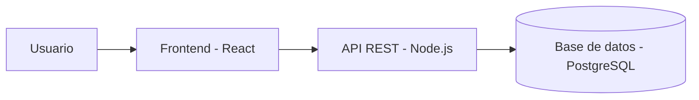

# Sistema de Biblioteca Virtual


Plataforma web moderna diseñada para la gestión, reserva y lectura de libros digitales en instituciones educativas. Permite a los estudiantes buscar títulos por categorías y a los administradores controlar el inventario en tiempo real.

## Tabla de contenidos

- [Descripción](#-descripción)
- [Instalación](#-instalación)
- [Uso](#-uso)
- [Estado de funcionalidades](#-estado-de-funcionalidades)
- [Pendientes](#-pendientes)
- [Arquitectura](#-arquitectura)
- [Contribuidores](#-contribuidores)

## Descripción

Este proyecto resuelve la necesidad de descentralizar el acceso a recursos bibliográficos, ofreciendo una interfaz rápida, intuitiva y con soporte para lectura offline. Fue desarrollado como parte de las prácticas avanzadas de documentación y desarrollo ágil.

## Instalación

Para clonar e instalar este proyecto en tu computadora, ejecuta los siguientes comandos en tu terminal:

```bash
# Clonar el repositorio 
git clone https://github.com

# Entrar a la carpeta del proyecto
cd laboratorio-readme

# Instalar las dependencias del proyecto
npm install
```

## Uso

Para iniciar el servidor de desarrollo local y probar la aplicación, ejecuta:

```bash
npm run dev
```
Luego, abre tu navegador web e ingresa a `http://localhost:3000`.

## Estado de funcionalidades

| Función | Estado |
| :--- | :--- |
| Catálogo de libros |  Listo |
| Login de usuarios |  Listo |
| Reserva de ejemplares | En progreso |
| Reportes PDF | En progreso |

## Pendientes

- [x] Diseño de la base de datos
- [x] Autenticación con JWT
- [ ] Implementar pasarela de pagos para penalizaciones
- [ ] Pruebas unitarias del sistema

## Arquitectura

El flujo de comunicación de los componentes del sistema sigue la siguiente estructura:



## Contribuidores

* **Nombre Completo** - *Desarrollador Principal* -

*ERICK ABEL ATAHUACHI DURAN*  [erickatahuachi-dev](https://github.com)
